# Portfolio — Baye Mor Gaye

Portfolio personnel de **Baye Mor Gaye**, etudiant en informatique a l'Universite Cheikh Anta Diop de Dakar. Plateforme mono-proprietaire avec publications de blog, projets portfolio, emploi du temps integre, ressources documentaires, commentaires et likes.

Modelise par 22 cas d'utilisation et 30 entites, couverts par 35 diagrammes UML.

---

## Sommaire

- [Demarrage rapide](#demarrage-rapide)
- [Architecture](#architecture)
- [Structure du projet](#structure-du-projet)
- [Stack technique](#stack-technique)
- [Developpement](#developpement)
- [Jeu de donnees](#jeu-de-donnees)
- [Modelisation UML](#modelisation-uml)
- [Licence](#licence)

---

## Demarrage rapide

**Prerequis :** Docker et Docker Compose (WSL2 ou terminal PowerShell).

```powershell
# cloner le projet
git clone <url-du-repo>
cd baye-mor-gaye

# lancer l'ensemble des services
docker compose up -d
```

La premiere construction peut prendre 5 a 10 minutes (download des images, npm install, composer install, compilation Next.js). Une fois termine :

| Service | URL |
|---------|-----|
| Frontend (Next.js) | http://localhost:3000 |
| API (Laravel) | http://localhost:8000/api |
| Base de donnees | localhost:3307 |

Le demarrage initial execute automatiquement les migrations, le seed et le cache Laravel via le point d'entree PHP-FPM. Aucune commande manuelle requise.

**Reinitialisation complete :**

```powershell
docker compose down -v
docker compose up --build -d
```

---

## Architecture

Cinq conteneurs orchestres sur le reseau `portfolio`.

```
                    Visiteur / Utilisateur / Proprietaire
                                 |
                          +------+------+
                          |   nginx:80  |  (port 8000)
                          +------+------+
                                 |
                    +------------+------------+
                    |                         |
            +-------v-------+        +--------+--------+
            |   php-fpm     |        |    frontend     |
            |  (Laravel 11) |        |  (Next.js 16)   |
            |   port 9000   |        |   port 3000     |
            +-------+-------+        +-----------------+
                    |
            +-------v-------+
            |      db       |
            |  (MySQL 8.0)  |
            |   port 3307   |
            +---------------+
```

- **nginx** : reverse proxy, sert les assets statiques, proxy les requetes API vers PHP-FPM
- **php-fpm** : heberge Laravel 11 avec Sanctum, Eloquent, OPCache + JIT, Horizon queues
- **frontend** : Next.js 16 avec App Router, Turbopack, TanStack Query
- **db** : MySQL 8.0, persistance via volume `db_data`
- **workspace** : conteneur de developpement (Composer, Artisan, npm)

Le frontend appelle l'API via nginx (`http://localhost:8000/api`). L'authentification est geree par Laravel Sanctum (jetons API avec cookies).

---

## Structure du projet

```
baye-mor-gaye/
├── 01-portfolio-laravel/     # Backend Laravel 11
│   ├── app/
│   │   ├── Http/Controllers/ # Controleurs API REST
│   │   ├── Models/           # Eloquent Models (30 entites)
│   │   └── Services/         # HtmlPurifierService, media, etc.
│   ├── database/
│   │   ├── migrations/       # 42 migrations
│   │   └── seeders/          # 14 seeders
│   └── routes/
│       └── api.php           # Routes API (94 endpoints)
│
├── 02-portfolio-nextJS/      # Frontend Next.js 16
│   ├── app/                  # App Router (pages publiques + dashboard)
│   ├── components/           # Composants React (UI, formulaires, medias)
│   ├── lib/                  # Sanitize, media, API client
│   ├── contexts/             # AuthContext, ThemeContext
│   ├── stores/               # Zustand stores
│   ├── hooks/                # Custom hooks
│   ├── schemas/              # Validation Zod
│   └── __tests__/            # Tests Vitest
│
├── docker/
│   ├── nginx/                # Configuration nginx (cache, proxy)
│   ├── php-fpm/              # Dockerfile, entrypoint, php.ini
│   ├── frontend/             # Dockerfile Next.js
│   └── workspace/            # Dockerfile CLI
│
├── uml-code/                 # Sources PlantUML (.wsd)
├── uml-svg/                  # Diagrammes generes (SVG)
├── docker-compose.yml        # Orchestration des services
└── plantuml.jar              # Moteur PlantUML
```

---

## Stack technique

### Frontend

| Technologie | Version | Usage |
|-------------|---------|-------|
| Next.js | 16.2.7 | Framework React SSR avec Turbopack |
| TypeScript | 5.x | Typage strict |
| Tailwind CSS | 3.4 + 4 | Styles utilitaires + @tailwindcss/typography |
| TanStack Query | 5.101 | Requetes API, cache, mutations |
| TipTap | 3.26 | Editeur riche (publications, tableaux, code ML) |
| lowlight | 3.3 | Coloration syntaxique (code blocks) |
| DOMPurify | 3.11 | Assainissement HTML cote client |
| Recharts | 3.8 | Graphiques statistiques |
| React Hook Form + Zod | 7.79 + 4.4 | Formulaires et validation |
| Zustand | 5.0 | Gestion d'etat legere |
| Vitest | 4.1 | Tests unitaires |
| Playwright | 1.61 | Tests E2E |

### Backend

| Technologie | Version | Usage |
|-------------|---------|-------|
| Laravel | 11 | Framework PHP |
| PHP | 8.3 FPM Alpine | Langage serveur |
| Sanctum | 4.x | Authentification API (jetons + cookies) |
| Eloquent ORM | inclus | Mapping objet-relationnel |
| OPCache + JIT | inclus | Acceleration PHP (buffer 64M, JIT 1255) |
| Horizon | 5.30 | Tableau de bord files d'attente Redis |
| PHPUnit | 11 | Tests backend |
| HtmlPurifier | 4.x | Assainissement HTML cote serveur |

### Infrastructure

| Technologie | Usage |
|-------------|-------|
| Docker Compose | Orchestration multi-conteneurs |
| MySQL 8.0 | Base de donnees relationnelle |
| Redis 7 | Cache, files d'attente, sessions |
| Laravel Echo Server | WebSocket temps reel |
| PaliGemma 2 (10B) | Vision IA (OCR emplois du temps) |
| PlantUML | Generation des diagrammes UML (35 schemas) |

---

## Developpement

### Commandes courantes

```powershell
# logs d'un service
docker compose logs -f php-fpm

# acceder au workspace (Composer / Artisan)
docker compose exec workspace bash

# lancer les tests frontend
docker compose exec frontend npm test

# lancer les tests backend
docker compose exec php-fpm php artisan test

# reconstruire un service apres modification du Dockerfile
docker compose build --no-cache php-fpm
docker compose up -d php-fpm
```

### Pipeline de demarrage (entrypoint.sh)

A chaque demarrage du conteneur php-fpm :

1. Attente que MySQL soit pret
2. `mkdir -p bootstrap/cache`
3. `php artisan optimize` (ou fallback : config:cache, route:cache, event:cache)
4. `php artisan storage:link`
5. `php artisan migrate:fresh --seed --force` (reinitialise et peuple la base)
6. Demarrage de PHP-FPM

En production, remplacer `migrate:fresh --seed` par `migrate --force`.

### Variables d'environnement

Les principales variables sont definies dans `docker-compose.yml` sous le service `php-fpm` :

| Variable | Valeur par defaut | Description |
|----------|-------------------|-------------|
| `PROPRIETAIRE_NOM` | Baye Mor Gaye | Nom du proprietaire |
| `PROPRIETAIRE_EMAIL` | contact@... | Email du proprietaire |
| `PROPRIETAIRE_PASSWORD` | password | Mot de passe du compte admin |
| `DB_DATABASE` | portfolio | Nom de la base |
| `SANCTUM_STATEFUL_DOMAINS` | localhost:3000 | Domaine SPA pour Sanctum |

---

## Jeu de donnees

Quatorze seeders peuplent la base avec des donnees realistes :

- **UtilisateurSeeder** : 10 utilisateurs fictifs
- **ProprietaireSeeder** : le compte proprietaire (Baye Mor Gaye)
- **CompetenceSeeder** : 10 competences (Laravel, React, Python, ML, etc.)
- **DomaineSeeder** : 6 domaines d'interet
- **PublicationSeeder** : 20 publications avec contenu HTML enrichi
- **ProjetPortfolioSeeder** : 10 projets (dont 5 en vedette)
- **CommentaireSeeder** : 300 commentaires dont 30 non approuves
- **EmploiDuTempsSeeder** : emploi du temps hebdomadaire
- **NotificationSeeder** : 20 notifications
- **ExperienceSeeder** : 5 experiences professionnelles
- **FormationSeeder** : 5 formations academiques
- **CertificationSeeder** : 5 certifications
- **RessourceSeeder** : 10 ressources documentaires
- **ContactSeeder** : 10 messages de contact

### Identifiants du compte proprietaire

```
Email:    contact@baye-mor-gaye.dev
Mot de passe: password
```

---

## Modelisation UML

Le projet inclut 35 diagrammes UML generes a partir de sources PlantUML (`uml-code/`). Les sorties SVG sont dans `uml-svg/`.

### Cas d'utilisation

22 cas d'utilisation organises selon trois acteurs hierarchises :

```
Proprietaire ---|> Utilisateur Authentifie ---|> Visiteur
```

**Visiteur** : consulter publications, profil public, projets portfolio, filtrer par technologie, lancer une demo, formulaire de contact.

**Utilisateur Authentifie** : s'authentifier, commenter, liker (herite du visiteur).

**Proprietaire** : gerer profil, competences, domaines, publications (CRUD + moderation), projets, emploi du temps (manuel + import vision IA), rappels, notifications, ressources, statistiques (herite de l'utilisateur authentifie).

<div align="center">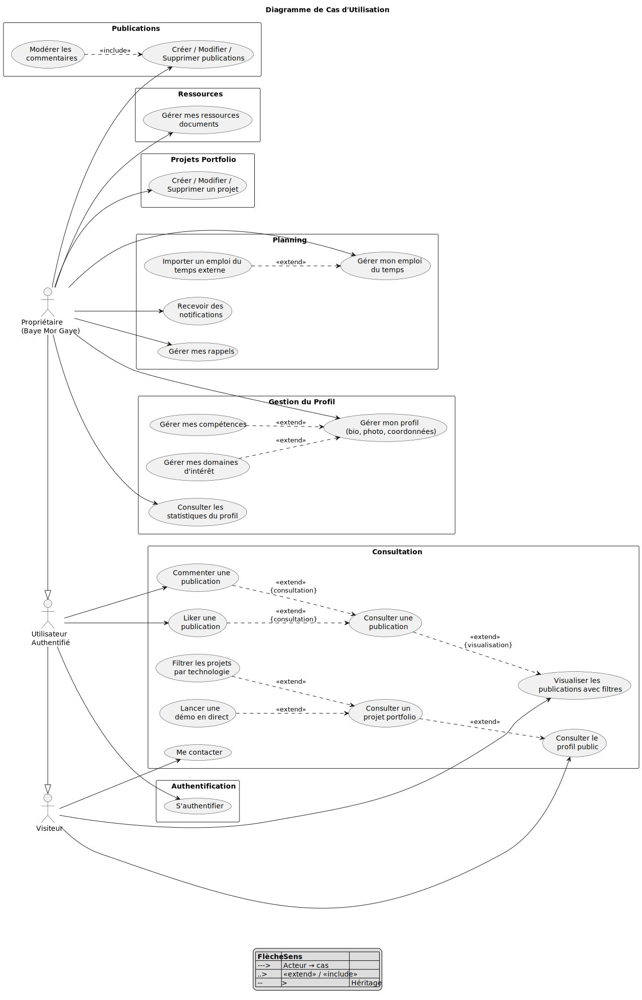</div>

### Diagramme de classes

30 entites, 4 enumerations, 2 traits transverses (Timestamps, SoftDeletes).

- **Authentification et Profil** : Utilisateur, Proprietaire, Competence, Domaine, NiveauCompetence
- **Publications et Interactions** : Publication, Commentaire, Like, MediaPublication
- **Projets Portfolio** : ProjetPortfolio, MediaProjet
- **Planning** : EmploiDuTemps, EvenementEDT, ConversionEDT, Rappel
- **Services** : Notification, VuePage, Ressource, Contact
- **Qualifications** : Experience, Formation, Certification, MediaQualification

<div align="center">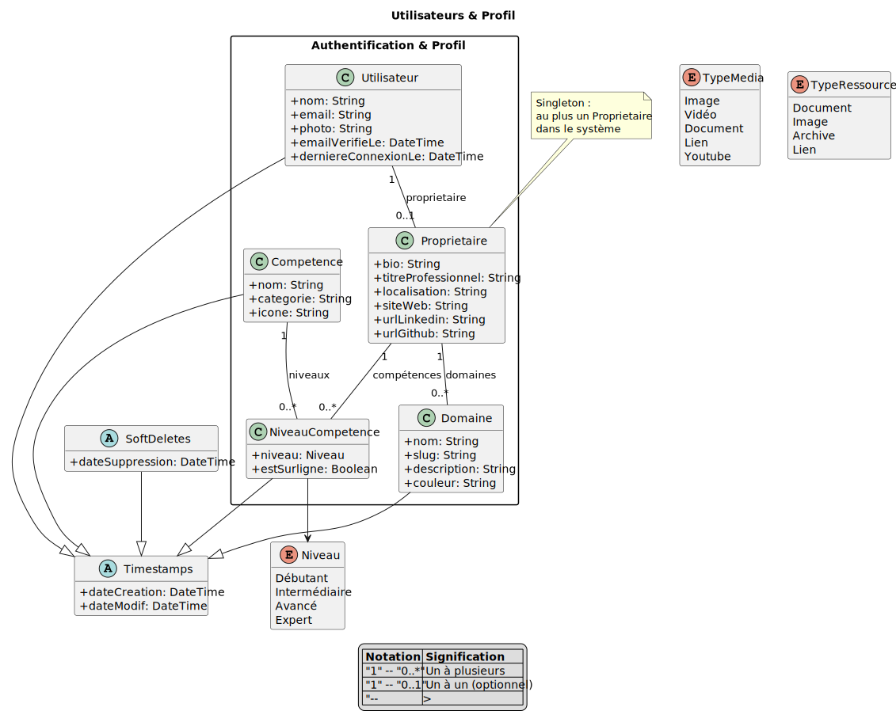</div>
<div align="center">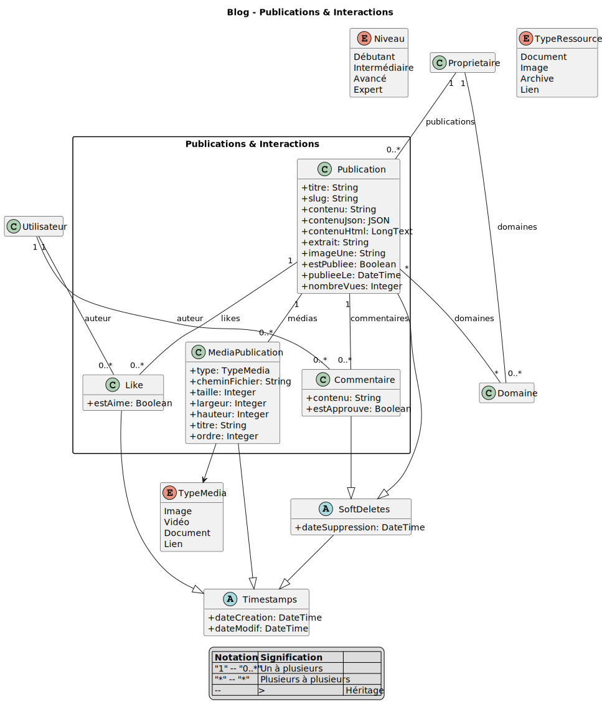</div>
<div align="center">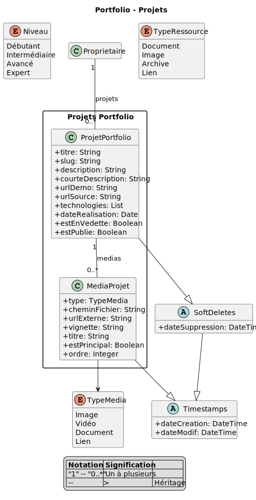</div>
<div align="center">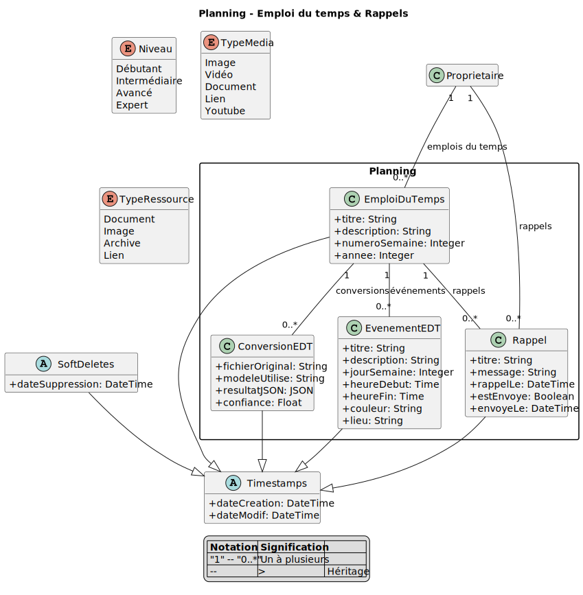</div>
<div align="center">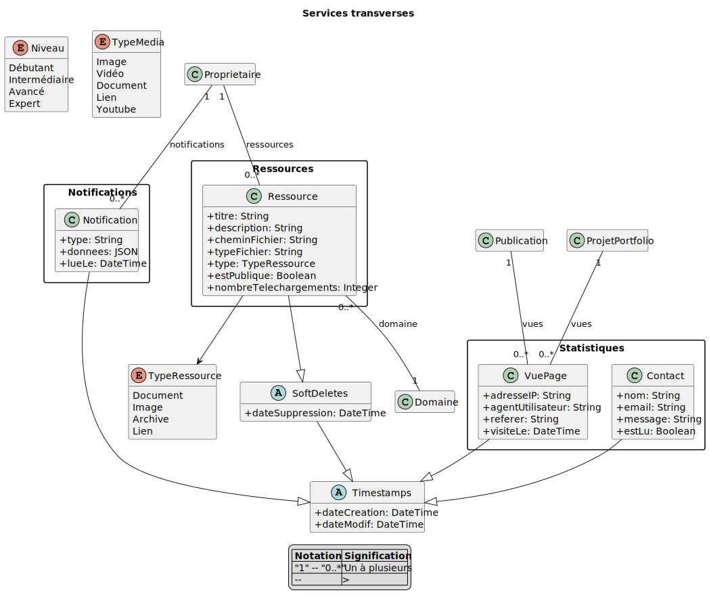</div>
<div align="center">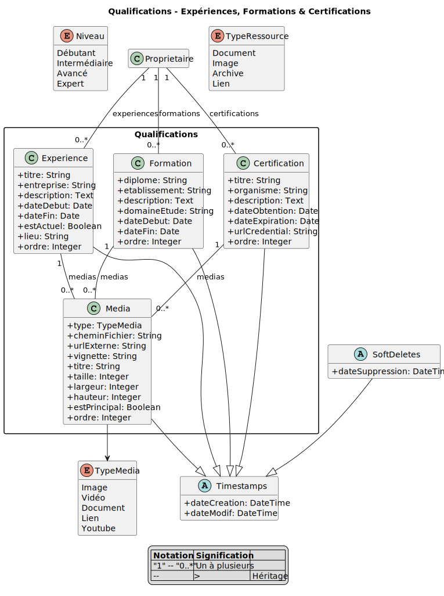</div>

### Diagrammes de sequence

14 diagrammes couvrant les processus metier : publication (editeur TipTap), emploi du temps (creation manuelle + import PaliGemma), interactions (consultation -> authentification -> commentaire/like), notifications (rappel -> file d'attente -> WebSocket), projet portfolio, moderation des commentaires, contact, competences, domaines, ressources, filtrage, experiences, formations, certifications.

<div align="center">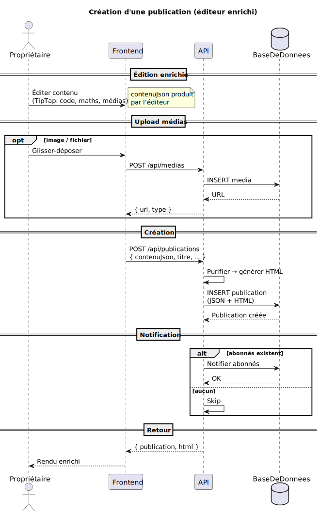</div>
<div align="center">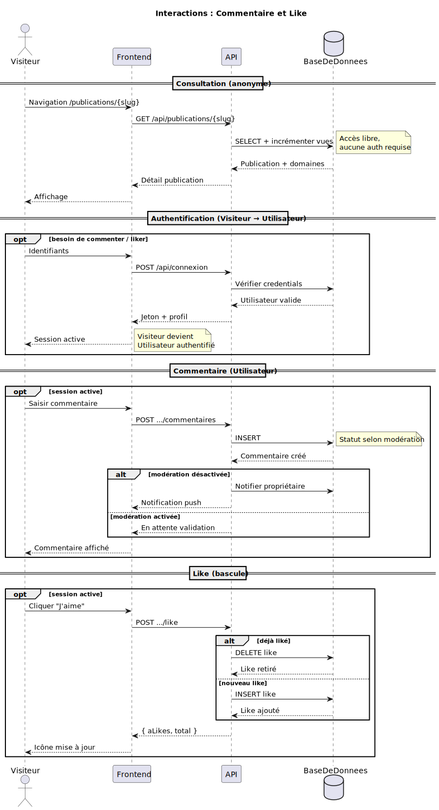</div>
<div align="center">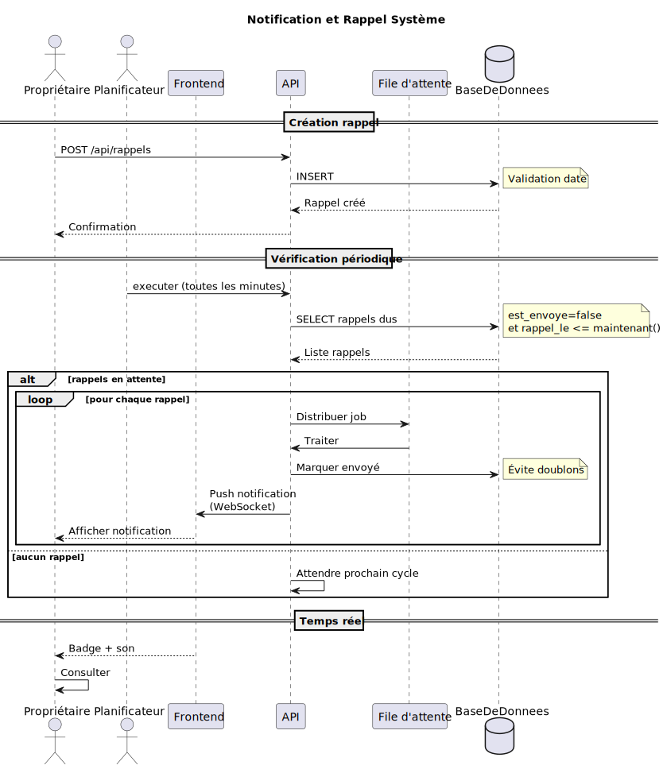</div>

### Diagrammes d'activite

10 diagrammes avec partitions par acteur : publication, emploi du temps (3 sources), notifications, projet, moderation, contact, competences, domaines, ressources, filtrage.

<div align="center">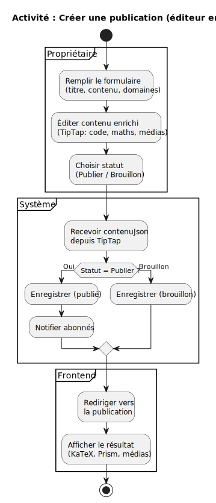</div>
<div align="center">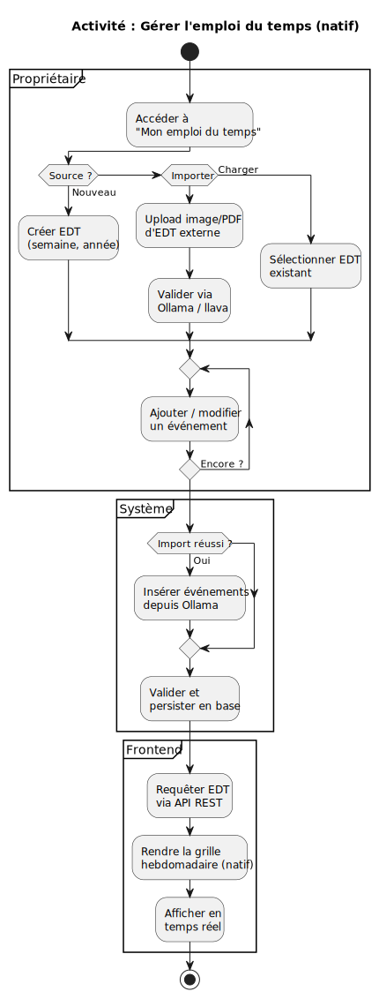</div>

### Diagrammes d'architecture

**Composants** : architecture conteneurisee avec les 5 services Docker, les services externes (SMTP, PaliGemma, Echo Server), et les protocoles de communication.

**Deploiement** : infrastructure sur hote unique, volumes montes en bind mount pour le developpement, exposition des ports 8000 (API) et 3000 (frontend).

<div align="center">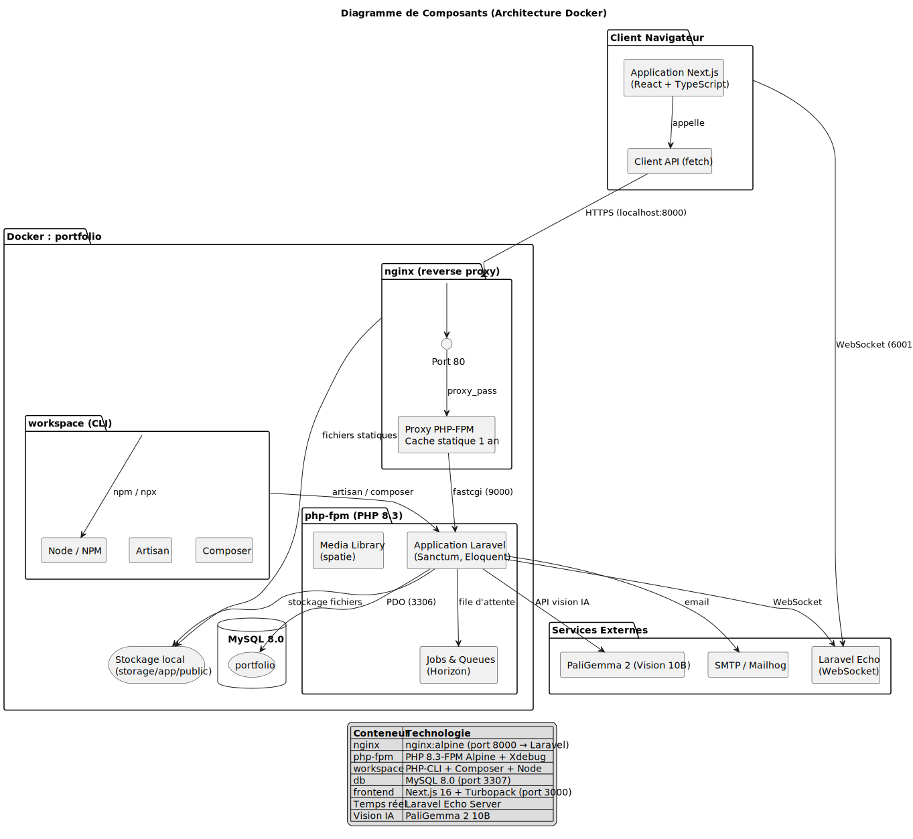</div>
<div align="center">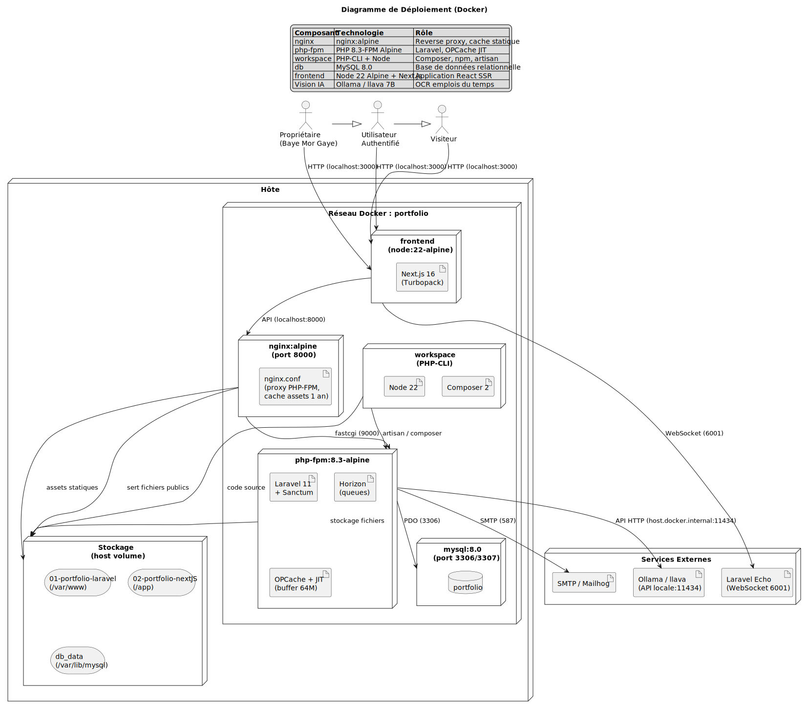</div>

### Regeneration des diagrammes

```powershell
Get-ChildItem -Recurse -Filter "*.wsd" uml-code/ | ForEach-Object {
    java -jar plantuml.jar -tsvg $_.FullName
}
```

Prerequis : Java 23+ et `plantuml.jar` a la racine.

---

## Licence

Proprietaire — Baye Mor Gaye (c) 2026
