# Portfolio — Baye Mor Gaye


Portfolio personnel de **Baye Mor Gaye**, etudiant en informatique a l'Universite Cheikh Anta Diop de Dakar. Ce projet modelise un portfolio mono-proprietaire avec interactions communautaires : publications de blog, projets portfolio, emploi du temps integre, ressources documentaires, commentaires et likes. L'ensemble est specifie par 22 cas d'utilisation et 30 entites, couverts par 35 diagrammes UML (cas d'utilisation, classes, sequences, activites, composants, deploiement).

---

## Sommaire

- [Hierarchie des acteurs](#hierarchie-des-acteurs)
- [Cas d'utilisation](#cas-dutilisation)
- [Diagramme de cas d'utilisation](#diagramme-de-cas-dutilisation)
- [Diagramme de classes](#diagramme-de-classes)
- [Diagrammes de sequence](#diagrammes-de-sequence)
- [Diagrammes d'activite](#diagrammes-dactivite)
- [Diagrammes d'architecture](#diagrammes-darchitecture)
- [Stack technique](#stack-technique)
- [Generation des diagrammes](#generation-des-diagrammes)
- [Licence](#licence)

---

## Hierarchie des acteurs

Le systeme distingue trois niveaux d'acces organises en heritage. Le **Visiteur** designe toute personne accedant au site sans authentification : il peut consulter les publications, le profil public, les projets portfolio, et utiliser le formulaire de contact. L'**Utilisateur Authentifie** herite du Visiteur et peut en plus commenter les publications et exprimer des likes, apres s'etre authentifie via l'API. Le **Proprietaire** (Baye Mor Gaye) herite de l'Utilisateur Authentifie et possede la totalite des droits de gestion : publications, projets, emploi du temps, competences, domaines d'interet, ressources, notifications, rappels et statistiques. Cette hierarchie est explicite dans le diagramme de cas d'utilisation par une relation de generalisation.

```
Proprietaire (Baye Mor Gaye) ---|> Utilisateur Authentifie ---|> Visiteur
```

---

## Cas d'utilisation

Le systeme comporte 22 cas d'utilisation repartis entre les trois acteurs.

Le **Visiteur** peut visualiser les publications avec filtres, consulter une publication en detail, consulter le profil public, consulter un projet portfolio, filtrer les projets par technologie, lancer une demo en direct, et utiliser le formulaire de contact. Il peut egalement commenter et liker une publication, mais ces actions etendent la consultation de publication et declenchent le besoin d'authentification.

L'**Utilisateur Authentifie** herite des droits du Visiteur et peut s'authentifier, ainsi que commenter et liker une publication.

Le **Proprietaire** herite des droits de l'Utilisateur Authentifie et dispose de dix cas dedies : gerer son profil, gerer ses competences, gerer ses domaines d'interet, consulter les statistiques de son profil, creer, modifier ou supprimer des publications, moderer les commentaires, creer, modifier ou supprimer des projets, gerer son emploi du temps, importer un emploi du temps externe par vision IA, gerer ses rappels, recevoir des notifications, et gerer ses ressources documentaires.

---

## Diagramme de cas d'utilisation

Le diagramme ci-dessous presente les 22 cas d'utilisation avec leurs relations d'extension et d'inclusion, ainsi que l'heritage entre les trois acteurs.

<div align="center"></div>

---

## Diagramme de classes

Le modele de classes comporte 30 entites, 4 enumerations, et 2 traits transverses (Timestamps avec dateCreation et dateModif, SoftDeletes avec dateSuppression). Chaque entite est alignee sur un ou plusieurs cas d'utilisation.

Le diagramme principal (master) presente l'ensemble du modele. Il est complete par cinq sous-diagrammes specialises.

Le package Authentification et Profil contient Utilisateur (avec nom, email, photo, emailVerifieLe, derniereConnexionLe), Proprietaire (qui etend Utilisateur avec bio, titreProfessionnel, localisation, siteWeb, urlLinkedin, urlGithub), Competence, Domaine et NiveauCompetence. Proprietaire possede les competences via NiveauCompetence et les domaines d'interet.

Le package Publications et Interactions regroupe Publication (avec contenu au format multiple, statut de publication, nombre de vues), Commentaire (avec estApprouve pour la moderation), Like, et MediaPublication. Publication est liee aux domaines par une relation plusieurs-a-plusieurs. L'Utilisateur est auteur des commentaires et des likes. Proprietaire est proprietaire des publications.

Le package Projets Portfolio contient ProjetPortfolio (avec urlDemo, urlSource, technologies sous forme de liste, estEnVedette) et MediaProjet. Proprietaire est proprietaire des projets.

Le package Planning contient EmploiDuTemps, EvenementEDT, ConversionEDT (avec fichierOriginal, modeleUtilise, resultatJSON, confiance) et Rappel. Proprietaire possede les emplois du temps et les rappels.

Le package Services regroupe Notification (avec type, donnees, lueLe), VuePage (traque des consultations), Ressource (documents avec visibilite publique) et Contact (formulaire libre sans relation utilisateur). Proprietaire possede les notifications et les ressources. VuePage est liee aux publications et aux projets.


<div align="center"></div>

<div align="center"></div>

<div align="center"></div>

<div align="center"></div>

<div align="center"></div>

---

## Diagrammes de sequence

Quatorze diagrammes de sequence detaillent les interactions entre acteurs, frontend, API et base de donnees pour chaque processus metier.

Le diagramme 03-sequence-publication montre la creation d'une publication avec l'editeur enrichi TipTap. Le Proprietaire edite le contenu (qui produit un contenuJson), uploade d'eventuels medias par glisser-deposer, puis soumet la publication. L'API purifie le contenu, genere le HTML, insere en base et notifie les abonnes.

Le diagramme 04-sequence-schedule couvre la gestion native de l'emploi du temps. Le Proprietaire cree un EDT, saisit les evenements avec verification de chevauchements, et peut importer un EDT externe par upload image/PDF. L'API utilise PaliGemma 2 pour la reconnaissance visuelle et propose un apercu si la confiance depasse 0.7. L'affichage est rendu nativement dans le frontend sous forme de grille hebdomadaire.

Le diagramme 05-sequence-interaction illustre le parcours complet du Visiteur jusqu'a l'interaction. La consultation est libre et anonyme. Si le visiteur souhaite commenter ou liker, il s'authentifie via l'API qui retourne un jeton. Il peut ensuite commenter (avec moderation optionnelle) ou liker (avec bascule).

Le diagramme 06-sequence-notification montre la gestion des rappels et notifications. Le Proprietaire cree des rappels. Un planificateur (Cron) verifie toutes les minutes les rappels dus et distribue les jobs via une file d'attente. Les notifications sont envoyees par WebSocket en temps reel.

Le diagramme 12-sequence-projet decrit la creation d'un projet portfolio avec upload de medias, validation des formats, lien de demo optionnel, et publication.

Le diagramme 14-sequence-moderation permet au Proprietaire de consulter la file d'attente des commentaires non approuves, de les approuver ou de les rejeter (soft delete), et eventuellement d'y repondre.

Le diagramme 15-sequence-contact montre le formulaire de contact soumis par le Visiteur : validation cote serveur, insertion en base avec est_lu a false, notification au proprietaire, et confirmation au visiteur.

Le diagramme 16-sequence-competences detalille la gestion des competences par le Proprietaire : liste, ajout (avec creation simultanee de Competence et NiveauCompetence), modification du niveau, et suppression en cascade.

Le diagramme 17-sequence-domaines couvre la gestion des domaines d'interet : creation avec slug automatique, modification, suppression avec dissociation des publications liees.

Le diagramme 18-sequence-ressources presente la gestion des ressources documentaires : upload avec stockage fichier, creation de l'entite Ressource en base, mise a jour des metadonnees, et suppression avec nettoyage du fichier physique.

Le diagramme 19-sequence-filtrage montre le visiteur parcourant les projets, filtrant par technologie via requete parametree (LIKE sur le champ technologies), et consultant le detail d'un projet selectionne.

Le diagramme 20-sequence-experiences detalille la gestion des experiences professionnelles par le Proprietaire : creation avec validation des dates, modification, et suppression.

Le diagramme 21-sequence-formations couvre la gestion des formations academiques : ajout d'un diplome avec etablissement, periode et domaine d'etude, modification et suppression.

Le diagramme 22-sequence-certifications presente la gestion des certifications : ajout avec organisme certificateur, date d'obtention et URL de verification, modification et suppression.

<div align="center"></div>

<div align="center">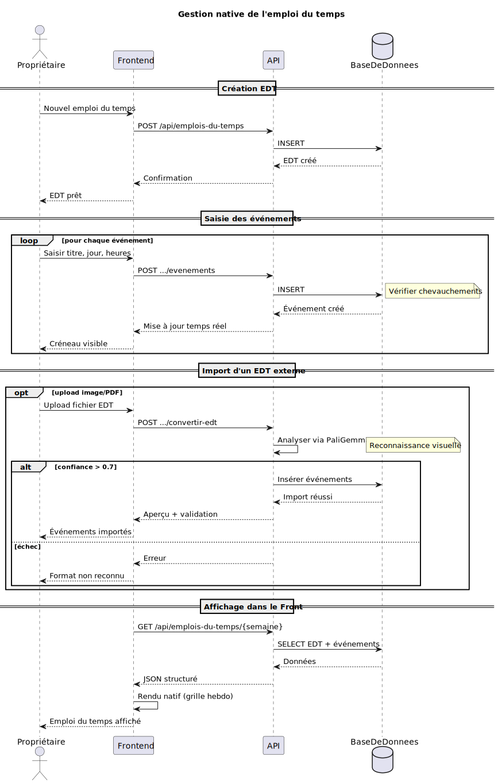</div>

<div align="center"></div>

<div align="center"></div>

<div align="center">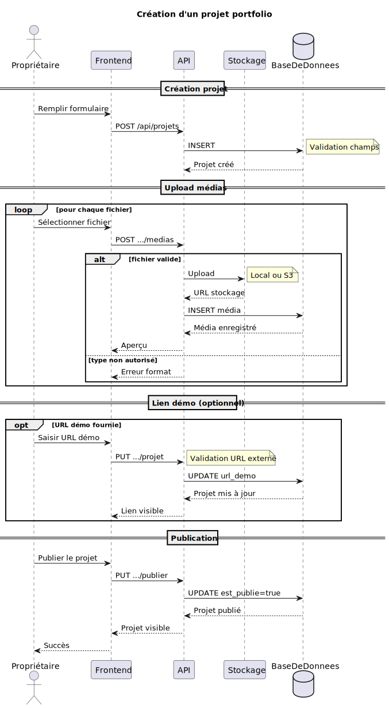</div>

<div align="center">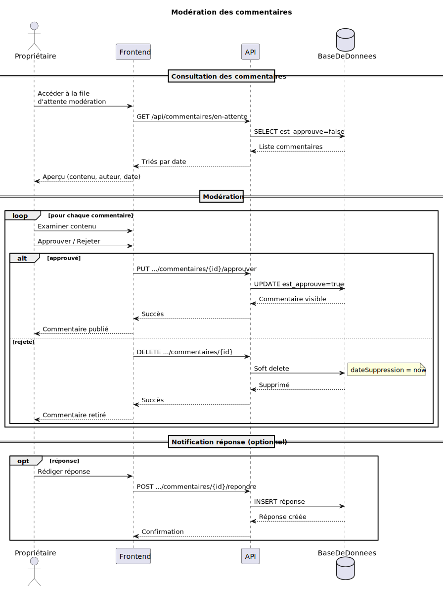</div>

<div align="center">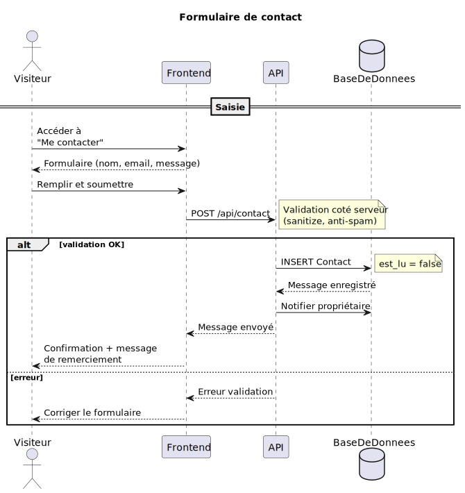</div>

<div align="center">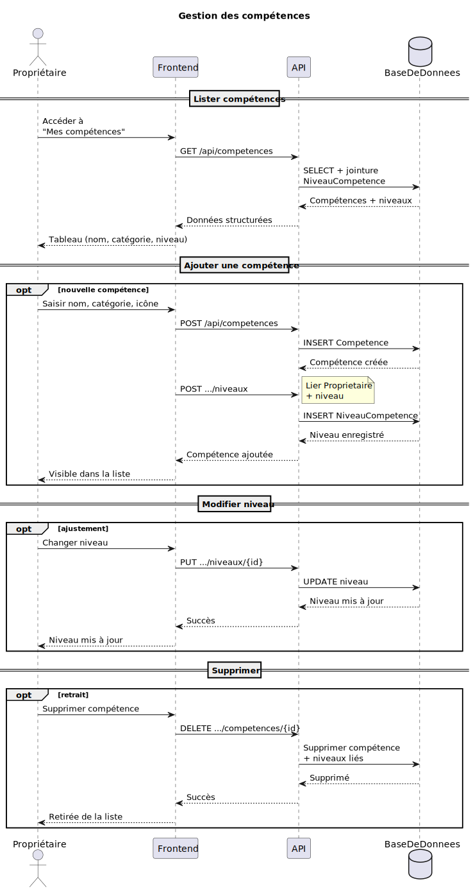</div>

<div align="center">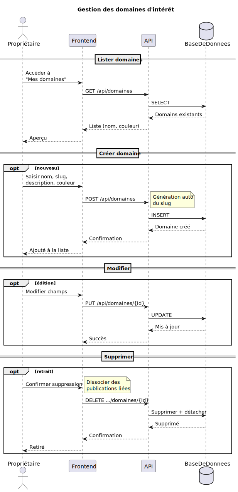</div>

<div align="center">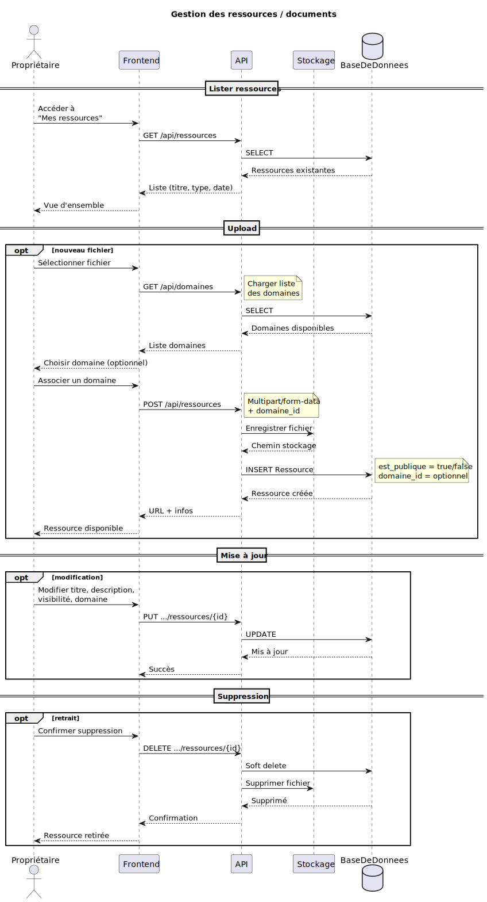</div>

<div align="center">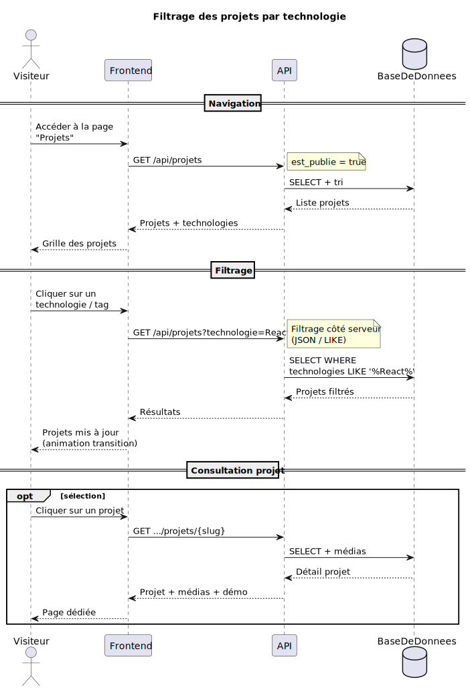</div>

<div align="center">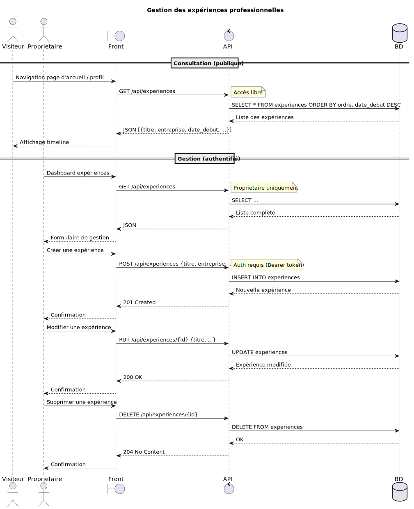</div>

<div align="center">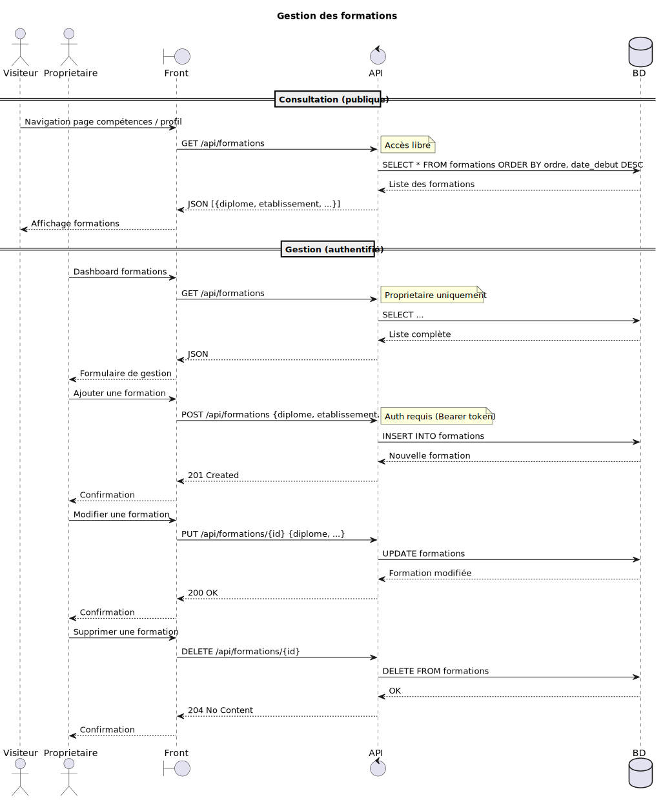</div>

<div align="center">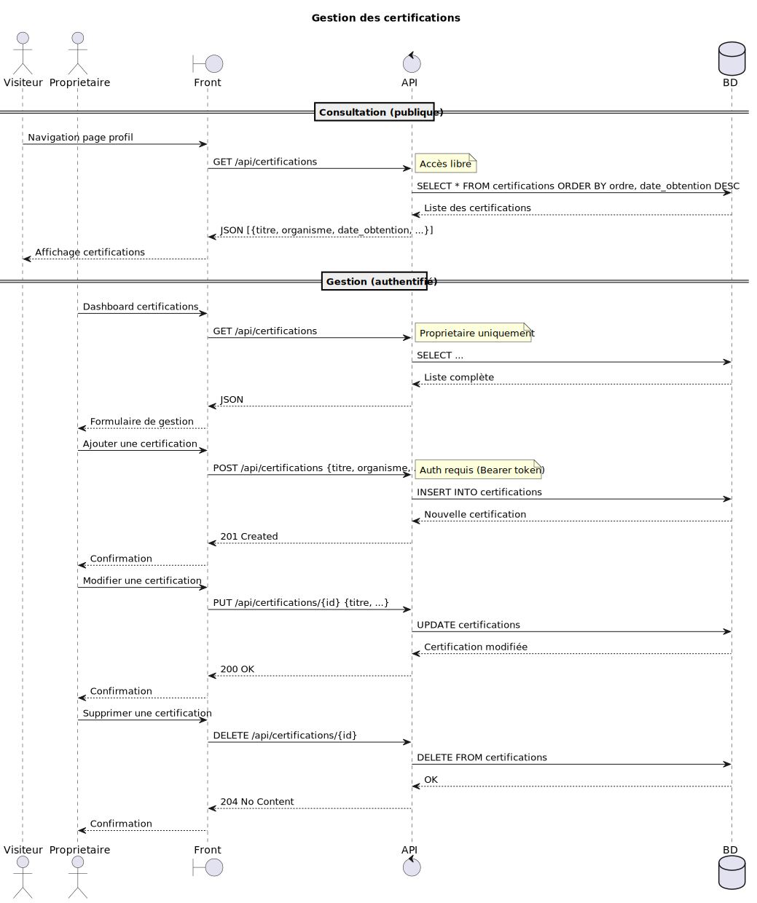</div>

---

## Diagrammes d'activite

Dix diagrammes d'activite decrivent les flux de travail en termes d'actions et de decisions, avec des partitions par acteur.

Le diagramme 07-activity-publication suit le Proprietaire depuis le remplissage du formulaire jusqu'a la publication, avec la bifurcation entre brouillon et publication (qui declenche la creation de version et la notification des abonnes).

Le diagramme 08-activity-schedule presente les trois sources possibles d'un EDT : creation manuelle, import par vision IA via PaliGemma, ou chargement d'un existant. Les evenements sont ajoutes en boucle, puis la grille est rendue nativement.

Le diagramme 09-activity-notification montre le Proprietaire creant des rappels et le systeme les verifiant periodiquement, avec distribution par file d'attente et notifications multicanaux (base de donnees, email, WebSocket).

Le diagramme 13-activity-projet illustre la creation ou modification d'un projet avec les options de demo en direct et de projet en vedette, avant publication.

Le diagramme 14-activity-moderation decrit le Proprietaire examinant chaque commentaire et decidant de l'approuver ou de le rejeter, avec notification a l'auteur.

Le diagramme 15-activity-contact suit le Visiteur remplissant et soumettant le formulaire, avec validation serveur et confirmation.

Le diagramme 16-activity-competences presente les trois actions possibles (ajouter, modifier, supprimer) avec les traitements systeme correspondants.

Le diagramme 17-activity-domaines suit le meme schema pour les domaines d'interet.

Le diagramme 18-activity-ressources couvre l'upload de fichiers avec stockage, la modification des metadonnees et la suppression avec nettoyage physique.

Le diagramme 19-activity-filtrage montre le parcours du Visiteur depuis l'affichage de la grille de projets, la selection d'un filtre technologie, la mise a jour de la grille, et la decision de consulter un projet ou de modifier le filtre.

<div align="center"></div>

<div align="center"></div>

<div align="center">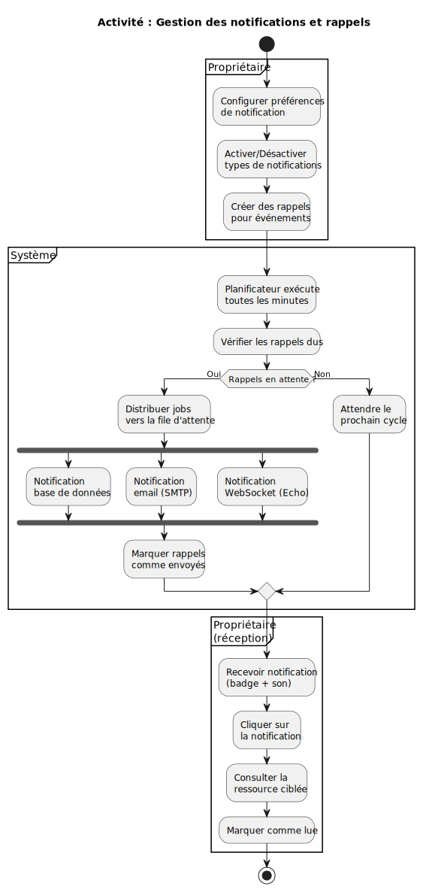</div>

<div align="center">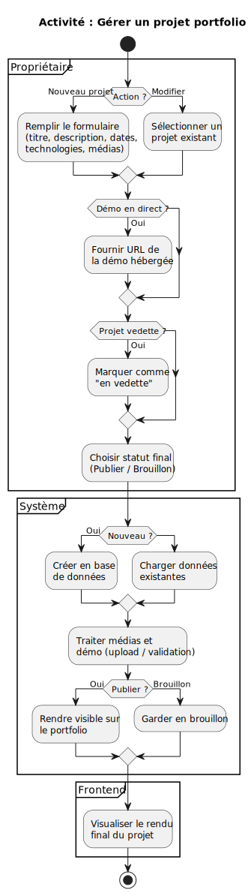</div>

<div align="center">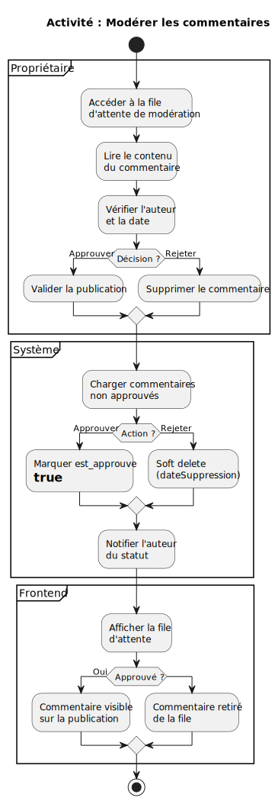</div>

<div align="center">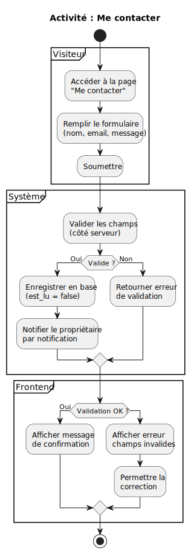</div>

<div align="center">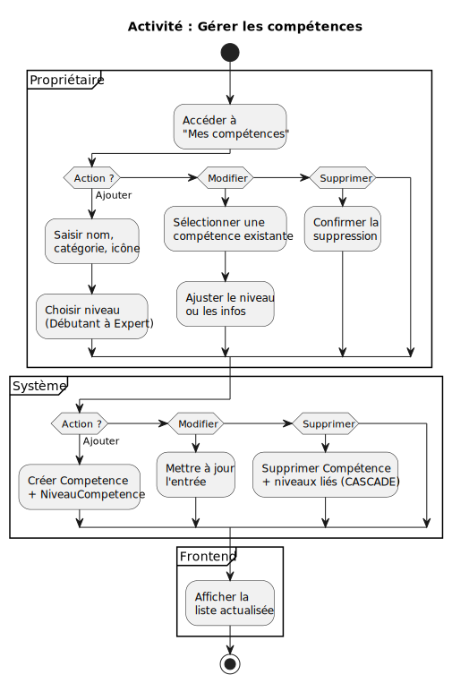</div>

<div align="center">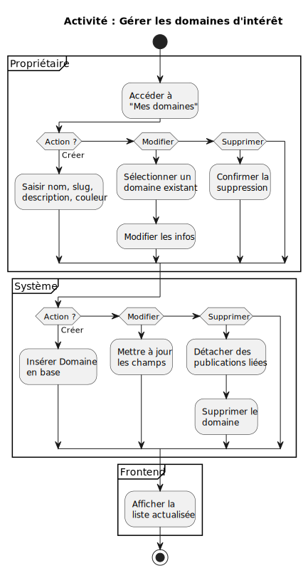</div>

<div align="center">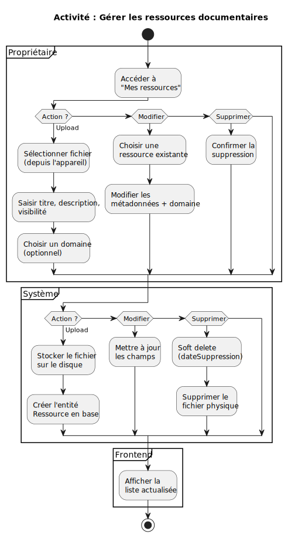</div>

<div align="center">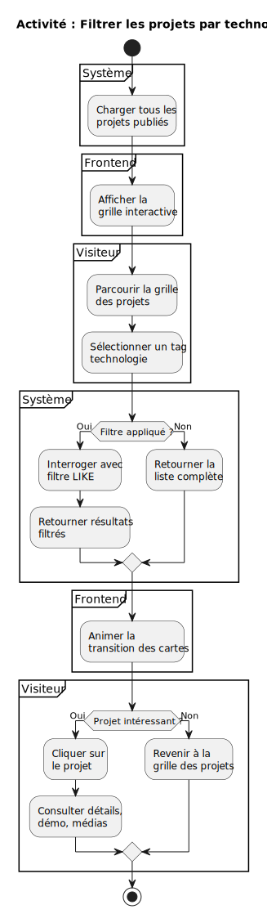</div>

---

## Diagrammes d'architecture

### Diagramme de composants

Le diagramme de composants presente l'architecture conteneurisee avec Docker. Cinq conteneurs orchestres sur le reseau `portfolio` :
- **nginx** (nginx:alpine) : reverse proxy, sert les assets statiques avec un cache d'un an, proxy_pass vers PHP-FPM sur le port 9000
- **php-fpm** (PHP 8.3-FPM Alpine) : heberge l'application Laravel 11 avec Sanctum, Eloquent, OPCache + JIT, les files d'attente Horizon, et spatie/media-library
- **workspace** (PHP-CLI + Node 22) : conteneur de developpement pour Composer, Artisan, npm — sans serveur web
- **db** (MySQL 8.0) : base de donnees relationnelle exposee sur le port 3307
- **frontend** (Node 22 Alpine) : application Next.js 16 avec Turbopack, build et servee sur le port 3000

Les services externes (SMTP, PaliGemma 2, Laravel Echo) restent inchanges.

### Diagramme de deploiement

Le diagramme de deploiement decrit l'infrastructure sur l'hote unique : les conteneurs Docker communiquent via le reseau interne `portfolio`. nginx sert d'entree unique (port 8000) et achemine les requetes API vers php-fpm. Le frontend Next.js est accessible directement sur le port 3000 et appelle l'API via nginx. Les volumes montes depuis l'hote (bind mounts) permettent le developpement en direct : le code Laravel dans `/var/www`, le code Next.js dans `/app`, et les donnees MySQL persistees dans `db_data`.

Les trois acteurs (Visiteur, Utilisateur Authentifie, Proprietaire) accedent au frontend par HTTP, avec la hierarchie d'heritage representee.

<div align="center"></div>

<div align="center"></div>

---

## Stack technique

### Conteneurisation (Docker Compose)

| Conteneur | Image | Port | Role |
|-----------|-------|------|------|
| **nginx** | `nginx:alpine` | 8000 | Reverse proxy, cache assets, proxy PHP-FPM |
| **php-fpm** | `php:8.3-fpm-alpine` (custom) | — | Laravel 11, OPCache + JIT, Horizon queues |
| **workspace** | `php:8.3-cli-alpine` (custom) | — | Composer, Artisan, npm, tty dev |
| **db** | `mysql:8.0` | 3307 | Base de donnees relationnelle |
| **frontend** | `node:22-alpine` (custom) | 3000 | Next.js 16 avec Turbopack |

### Frontend

| Technologie | Version | Usage |
|-------------|---------|-------|
| Next.js | 16.2.7 | Framework React SSR avec Turbopack |
| TypeScript | ~5.8 | Typage strict de l'application |
| Tailwind CSS | 4 | Styles utilitaires |
| TanStack Query | 5.75 | Requetes API, cache, mutations |
| TipTap | ~2.11 | Editeur riche (publications) |
| Recharts | ~2.15 | Graphiques statistiques |
| Motion | ~12 | Animations |

### Backend

| Technologie | Version | Usage |
|-------------|---------|-------|
| Laravel | 11 | Framework PHP |
| PHP | 8.3 FPM Alpine | Langage serveur |
| Sanctum | ~4.18 | Authentification API (jetons) |
| Eloquent ORM | inclus | Mapping objet-relationnel |
| spatie/media-library | ~11 | Gestion des medias |
| OPCache + JIT | inclus | Acceleration PHP (buffer 64M, JIT 1255) |
| Horizon | ~5.30 | Tableau de bord files d'attente Redis |

### Infrastructure

| Technologie | Version | Usage |
|-------------|---------|-------|
| MySQL | 8.0 | Base de donnees (prod) |
| Redis | 7 | Cache, files d'attente, sessions |
| Laravel Echo Server | ~7 | WebSocket temps reel |
| PaliGemma 2 | 10B | Vision IA (OCR emplois du temps) |
| SMTP / Mailhog | — | Envoi d'emails |

### Modelisation

| Technologie | Version | Usage |
|-------------|---------|-------|
| PlantUML | 1.2026.x | Diagrammes UML (31 schemas) |
| Java | 23 | Execution PlantUML |

---

## Generation des diagrammes

Tous les diagrammes sont generes a partir des fichiers source `.wsd` situes dans `uml-code/` organises par type (use-cases, class-diagram, sequences, activities, architecture). Les sorties SVG sont produites dans `uml-svg/` avec la meme arborescence.

La commande suivante regenere l'integralite des 35 diagrammes. Elle parcourt recursivement les fichiers source, maintient la structure de dossiers, et invoque PlantUML en mode SVG pour chaque fichier.

```powershell
Get-ChildItem -Recurse -Filter "*.wsd" uml-code/ | ForEach-Object {
  java -jar plantuml.jar -tsvg $_.FullName
}
```

Pour un diagramme specifique :

```bash
java -jar plantuml.jar -tsvg uml-code/architecture/11-deployment-diagram.wsd
```

Prerequis : Java 23 ou superieur et le fichier `plantuml.jar` place a la racine du projet.

---

## Licence

Proprietaire — Baye Mor Gaye © 2026